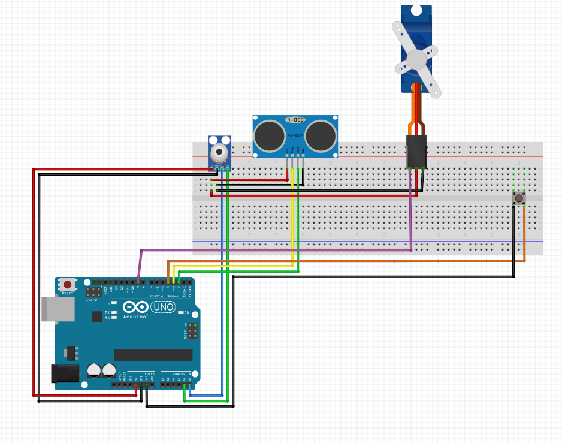
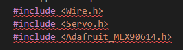
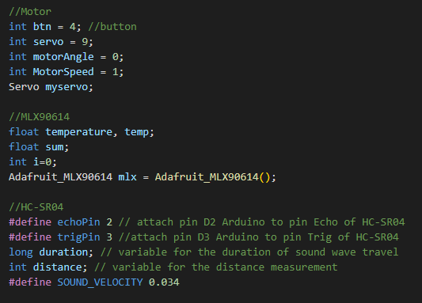
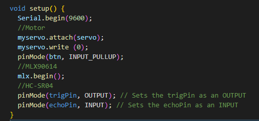
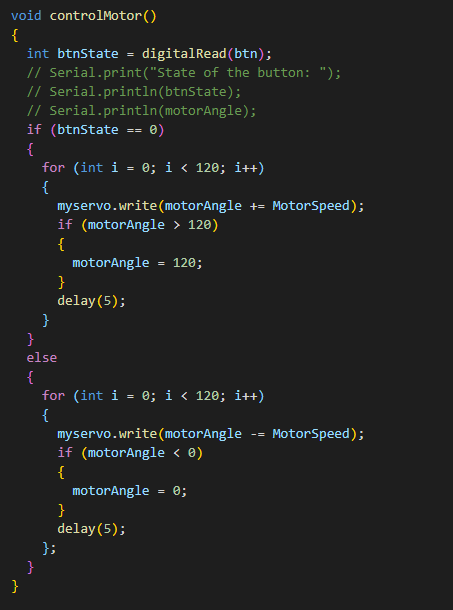
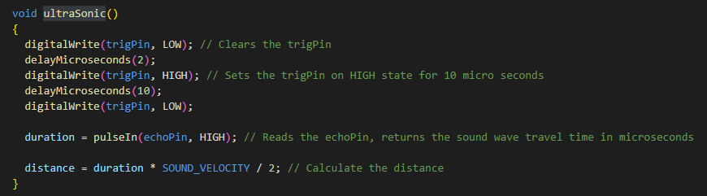
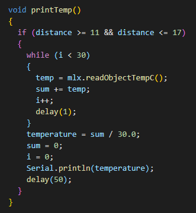
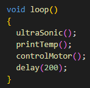

# rmit-eyes-arduino

Description: this is an IoT related project made by a group of students in RMIT University. the objective of the IoT stuture is to reduce Covid cases in the school by replacing a manual temperature checking with automatic temperature checking and automatic door

Components contain: Arduino Uno, MLX90614, HC-SR04, micro servo motor, a physical button

Brief ussage of each components: 
<li>MLX90614: To capture the temperature of the object; or in this case, body temperature</li>
MLX90614: To capture the temperature of the object; or in this case, body temperature
HC-SR04(Ultra Sensor): To detect the distance of the object and only record temperature data if only the object is in a certain distance
Micro servo: This is the automatic door that is control by the button
Button: If pressed the micro servo will rotate 120 degree and if not, it goes back to 0 degree 

library used: 

Variables: 

Setup:

Motor control Function:

Calculate object distant with HC-SR04:

Return Temperature if the object is in the correct distance:

Loop function:

